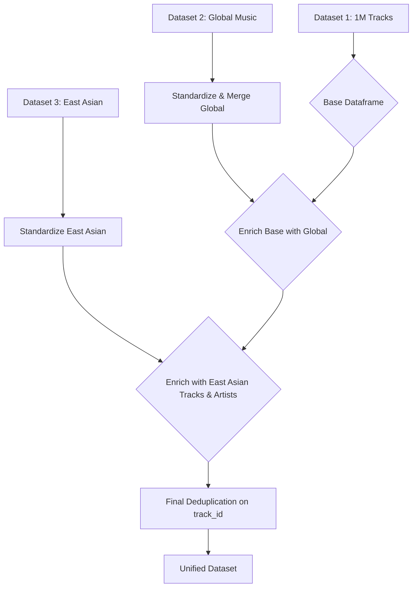

# Data Processing and Merge Plan

## 1. Objective

The goal of this plan is to merge three distinct Spotify datasets into a single, unified dataset. This dataset will serve as the foundation for a mood-based music recommendation system. A key requirement is the inclusion of audio features, which are crucial for mood analysis.

## 2. Datasets Overview

- **Dataset 1: 1 Million Tracks Dataset (`spotify_data.csv`)**
  - **Role:** Base dataset.
  - **Key Features:** Contains comprehensive track information, including the critical audio features (`danceability`, `energy`, `valence`, etc.). `track_id` is available.
- **Dataset 2: Global Music Dataset (2009-2025) (`spotify_data_clean.csv`, `track_data_final.csv`)**
  - **Role:** Enrichment dataset.
  - **Key Features:** Provides additional tracks and potentially more up-to-date metadata like `track_popularity`.
- **Dataset 3: Popular East Asian Artists and Tracks (`east_asia_top_artists.csv`, `east_asia_top_tracks.csv`)**
  - **Role:** Enrichment dataset.
  - **Key Features:** Adds popular East Asian music and provides richer artist-level data (`followers`, etc.).

## 3. Unified Schema

The final merged dataset will be based on the schema of the **1 Million Tracks Dataset**. This ensures that all audio feature columns are present. The schema will include, but is not limited to:

- `track_id` (Primary Key)
- `track_name`
- `artist_name`
- `album_name`
- `release_date` / `year`
- `popularity`
- `duration_ms`
- `explicit`
- `genres`
- `danceability`
- `energy`
- `key`
- `loudness`
- `mode`
- `speechiness`
- `acousticness`
- `instrumentalness`
- `liveness`
- `valence`
- `tempo`
- `artist_followers`
- `artist_popularity`

## 4. Processing and Merge Strategy

The merge process will be executed in the following steps:

### Step 1: Base Dataset Preparation
- Load the `spotify_data.csv` from the **1 Million Tracks Dataset**.
- This will be our primary dataframe.

### Step 2: Column Standardization
- Across all datasets, ensure column names are consistent. For example:
  - Rename `song_name` in `east_asia_top_tracks.csv` to `track_name`.
  - Convert `track_duration_min` in `spotify_data clean.csv` to `duration_ms`.

### Step 3: Enrich with Global Music Dataset
- Load `track_data_final.csv` and `spotify_data clean.csv`.
- Combine these two files, deduplicating on `track_id`.
- Perform a left merge with the base dataset, using `track_id` as the key. This will add new tracks and allow for updating metadata for existing tracks.

### Step 4: Enrich with East Asian Music Dataset
- **Tracks:**
  - Load `east_asia_top_tracks.csv`.
  - Standardize column names.
  - Append these tracks to the main dataframe.
- **Artists:**
  - Load `east_asia_top_artists.csv`.
  - Perform a left merge with the main dataframe on `artist_name` to add/update artist-specific information like `artist_followers`.

### Step 5: Deduplication
- After all merges, remove duplicate entries based on `track_id`. The most complete record (e.g., the one with audio features) should be kept.

### Step 6: Handling Missing Data
- For tracks added from the Global and East Asian datasets, the audio feature columns will be `null`. These will be handled in one of two ways:
  1. **Imputation:** Use simple imputation methods (e.g., mean/median) if appropriate for the model.
  2. **API Enrichment (Phase 2):** A future step could involve using the Spotify API to fetch the missing audio features for these tracks.
  3. **Model Robustness:** The recommendation model will be designed to be robust to missing feature data.

## 5. Mermaid Diagram of Workflow

